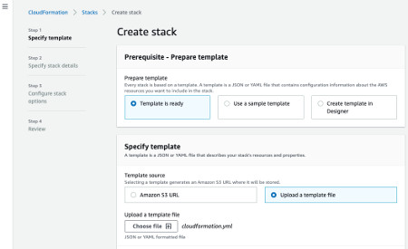
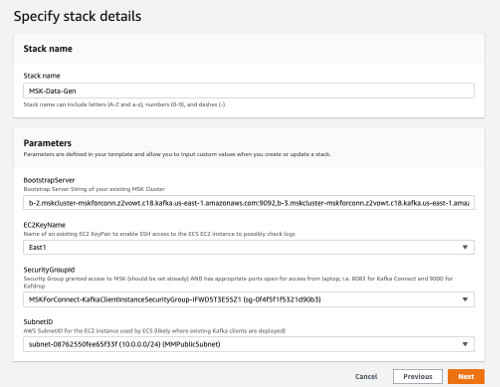
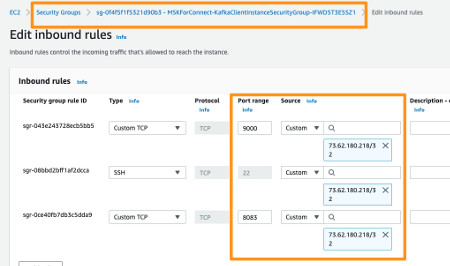
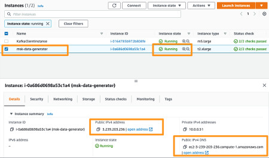

# Amazon MSK Data Generator

MSK Data Generator is a translation of the *awesome* Voluble Apache Kafka 
data generator from Clojure to Java.  (Link in Resources Section below)

The killer feature is being able to generate
events which reference other generated events.  (AKA: cross-reference, reference-able, joinable, etc.)

For example, we can generate one stream of Order events containing a customer_id (as well as price, sku, quantity, etc.) 
and at the same time, we can generate a different stream of Customer events containing a customer_id (as well as first name, last name, location, etc.)
The dynamically generated Customer event customer_id can reference the Order event customer_id.

#### Why this matters?

Multiple streams of "joinable" data is especially useful when building 
stream processor applications (in `Kinesis Data Analytics for Apache Flink` or `Kinesis Data 
Analytics Studio` for example) which perform joins.

#### Why translate to Java? 

By translating to Java, the hope is we open up the potential of wider community
collaboration.  (Nothing against Clojure mind you!  It's just more folks know Java.)

This project can likely be used outside of Amazon MSK, but to start at least, the focus will be making 
this generator easy to use with Amazon MSK. 

#### Further Context

MSK Data Generator is deployed and configured as a Kafka Connect _Source_,
so basic knowledge of Kafka Connect will be helpful.

Like many dynamic data generation projects, the key component is the use 
of Java Faker library.  Knowing more about Java Faker capabilities and options will be helpful.  
See link in Resources section below.

## Getting Started

When you have an existing MSK cluster (configured with no authentication) you can run the CloudFormation template
found in the [deploy](./deploy/) directory of this repo.

### Requirements

* Bootstrap Server string of your existing MSK Cluster

* Existing Security Group ID with access to MSK Broker endpoints (minimum. more on this below)

* Subnet ID of where to deploy MSK Data Generator


Here's a walk-through example of one way to get started

1. From CloudFormation Console, Create Stack with upload of ./deploy/cloudformation.yml file as shown and click Next  

    

2. Complete form according to your environment.  For example  
  
    * Stack Name: anything you want # Example below is "MSK-Data-Gen"
  
    * BootstrapServer: bootstrap server string of your cluster
  
    * EC2KeyName: existing EC2 pair in case you want to ssh to the ECS EC2 instance
  
    * SecurityGroupId: existing security group with access to MSK cluster AND ports 8083 and 9000 open.  More on this below.
  
    * SubnetID: where the ECS EC2 instance will be deployed; presumes access to MSK Cluster
  
    
 
    #### Note on `SecurityGroupId`
    
    At minimum, the specified Security Group should have access to MSK ports.  In addition, in this example, open access for 
    ports 8083 (to configure MSK Data Generator from your environment) and 9000 (for Kafdrop access from your environment).
    
    For example, the following shows the Security Group specified in example above
    has ports 22, 8083, and 9000 open from my laptop IP
    
    
    
    In turn, my MSK Security Group allows access from this Security Group as shown
    
    
    
    Notice how my security group id starting with "sg-0f4" is allowed access to MSK related ports and also access to ports 
    9000 and 8083 from my laptop ip address.  Of course, these values are dependent on your environment and you may simply 
    use one security group if desired.  This is just an example.

    To Continue Click Next and Next again on the following screen.  

3. Create Stack

    On the final review screen, acknowledge creation of IAM resources and click Create Stack button
    
    Example
    
    
    
4. MSK Data Generator Access

    After a few minutes, the CloudFormation template will complete and you should have a new EC2 instance called 
    "msk-data-generator" in your EC2 Console.  For example
    
    

    Note the public ip address or public DNS for next step
    
5. Sanity Check

    Using your public ip address or public DNS obtained from previous step, open Kafdrop on port 9000
    
    In this particular example, I would open http://ec2-3-239-203-236.compute-1.amazonaws.com:9000/
    
    Note: It may take 30 seconds or so for Kafdrop UI to first load.
    
    Also, confirm you can query the Kafka Connect REST endpoint on port 8083
    
    For my particular example, http://ec2-3-239-203-236.compute-1.amazonaws.com:8083/connector-plugins/ and I 
    would expect to see JSON response similar to the following
    
    ```
   [{"class":"com.amazonaws.mskdatagen.GeneratorSourceConnector","type":"source","version":"0.4"},
    {"class":"org.apache.kafka.connect.file.FileStreamSinkConnector","type":"sink","version":"2.7.0"},
   {"class":"org.apache.kafka.connect.file.FileStreamSourceConnector","type":"source","version":"2.7.0"},
   {"class":"org.apache.kafka.connect.mirror.MirrorCheckpointConnector","type":"source","version":"1"},
   {"class":"org.apache.kafka.connect.mirror.MirrorHeartbeatConnector","type":"source","version":"1"},
   {"class":"org.apache.kafka.connect.mirror.MirrorSourceConnector","type":"source","version":"1"}]
   ```

    Assuming you were successful on both of these sanity checks, you are now ready to start and configure
    the MSK Data Generator.
    
6. Start Generating Data into MSK

    To start generating data, POST in configuration.  (See the ./examples directory for examples).
    
    For example, in my environment, I could POST the following JSON to start generating data
    
    curl -X POST -H "Content-Type: application/json" -d @./examples/new-orders.json http://ec2-3-239-203-236.compute-1.amazonaws.com:8083/connectors

    and if successful, you'll see a response similiar to the following
    
    ```
   {
         "name": "msk-data-generator",
         "config": {
           "connector.class": "com.amazonaws.mskdatagen.GeneratorSourceConnector",
           "genkp.customer.with": "#{Code.isbn10}",
           "genv.customer.name.with": "#{Name.full_name}",
           "genv.customer.gender.with": "#{Demographic.sex}",
           "genv.customer.favorite_beer.with": "#{Beer.name}",
           "genv.customer.state.with": "#{Address.state}",
           "genkp.order.with": "#{Code.isbn10}",
           "genv.order.product_id.with": "#{number.number_between '101','109'}",
           "genv.order.quantity.with": "#{number.number_between '1','5'}",
           "genv.order.customer_id.matching": "customer.key",
           "global.throttle.ms": "2000",
           "global.history.records.max": "1000",
           "name": "msk-data-generator"
         },
         "tasks": [],
         "type": "source"
       }
   ```

7. Confirm Data Generation

    Next, you can confirm you are generating data with Kafdrop.  If you used the above example,
    you'll see `order` and `customer` topics now.  For example
    
    

    Nice.  Next steps are learning more about configuration options so you can customize
    the data being generated.  Also, you'll benefit from knowing more about how to operate the
    data generator.

## Data Generation Usage and Configuration

For further information on configuration options, check both the Voluble README as well as some of the 
[examples in this repo](./examples/)
    
## MSK Data Generation Operations

  In the example above, MSK Data Generator is deployed in a single node Kafka Connect cluster running
  in distributed mode.  This simply means creating or updating data generation configuration is accomplished 
  through expected REST API endpoint calls.  
  
  Examples
  
  * To update configuration of an existing running data generator, use a PUT call, but as with Kafka Connect, remove `config` wrapper when updating

    Example of updating an already running data generator (notice PUT URI to /connectors/msk-data-generator/config and `config` wrapper element in JSON is missing)
    
    ```
    curl -X PUT -H "Content-Type: application/json" \
    -d `{ "name": "msk-data-generator",
            "connector.class": "com.amazonaws.mskdatagen.GeneratorSourceConnector",
        
            "genv.impressions.bid_id.with": "#{Code.isbn10}",
            "genv.impressions.i_timestamp.with":"#{date.past '10','SECONDS'}",
            "genv.impressions.campaign_id.with": "#{Code.isbn10}",
            "genv.impressions.creative_details.with": "#{Color.name}",
            "genv.impressions.country_code.with": "#{Address.countryCode}",
        
        
            "genkp.clicks.with": "#{Code.isbn10}",
            "genv.clicks.c_timestamp.with":"#{date.past '10','SECONDS'}",
            "genv.clicks.correlation_id.matching": "impressions.value.bid_id",
            "genv.clicks.tracker.with": "#{Lorem.characters '15'}",
        
            "global.throttle.ms": "5000",
            "global.history.records.max": "10"
        }`
     http://ec2-3-239-203-236.compute-1.amazonaws.com:8083/connectors/msk-data-generator/config
    ```

  * List running connectors
    
    Example
    `curl http://ec2-3-239-203-236.compute-1.amazonaws.com:8083/connectors/`

  * Stop or Delete a running connector
  
    Example
    
    `curl -X DELETE -H "Content-Type: application/json"  http://ec2-3-239-203-236.compute-1.amazonaws.com:8083/connectors/msk-data-generator/`
  
  
## External References

* Voluble (basis for this project) https://github.com/MichaelDrogalis/voluble

* Java Faker https://github.com/DiUS/java-faker 


