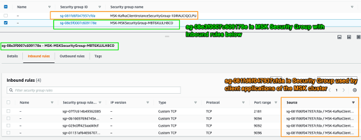
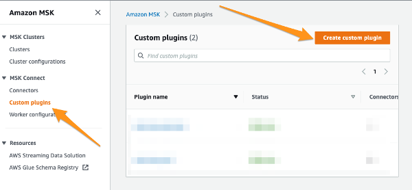
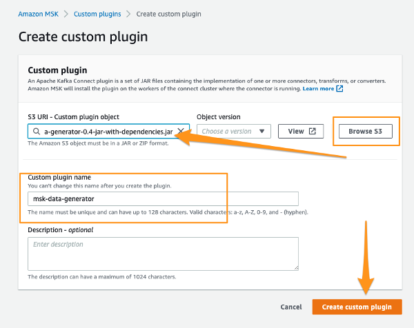
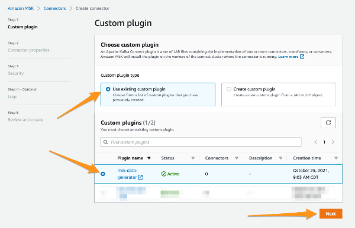
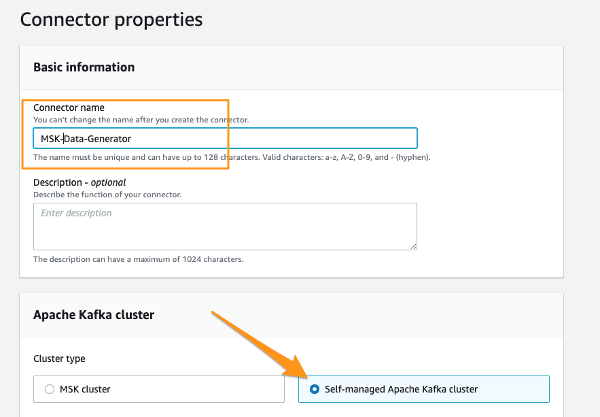
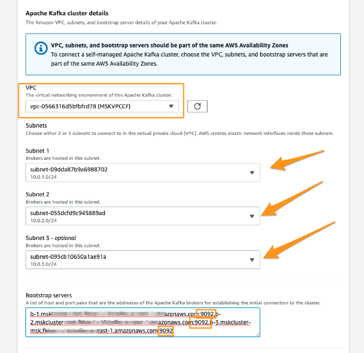
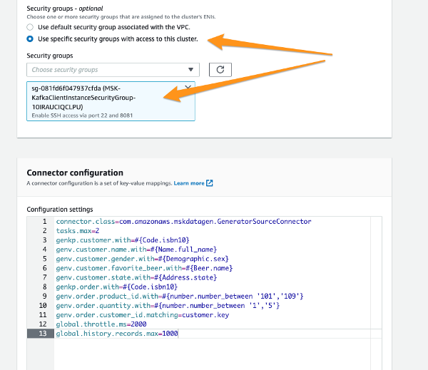
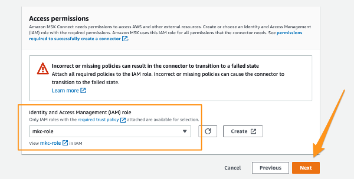
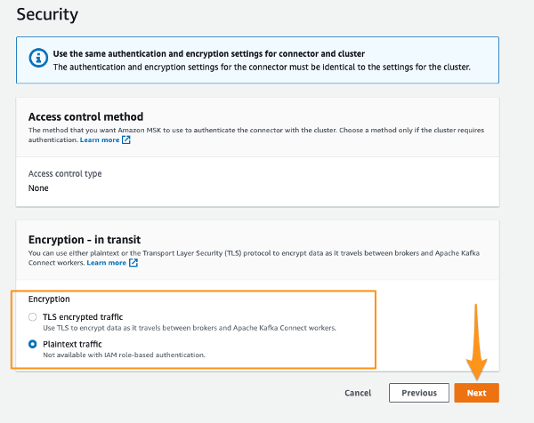
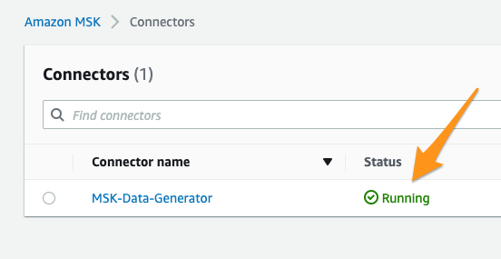

# How to Deploy MSK Data Generator on MSK Connect

MSK Data Generator may be deployed via MSK Connect in different ways.  In this tutorial, we will describe how to deploy when you are using two Security Groups and your MSK Cluster is _configured to allow Unauthenticated access_.

Two Security Groups are what is recommended in the [MSK Labs](https://amazonmsk-labs.workshop.aws/).  In essense, one Security Group is associated to the MSK cluster and provides opening to your MSK ENI ports such as 2181, 9092, 9094, or 9098 to the second Security Group source.  

Example of Two Security Groups

## Overview

MSK Connect connectors are deployed by uploading a JAR or ZIP file to S3, setting access rules via IAM, and then deploying the connector via the MSK Console or AWS API.  In this tutorial, we will deploy via MSK Console.

## Prerequisites

This tutorial has three requirements before proceeding with the Deployment Steps.

1. You have a MSK Cluster configured to allow Unauthenticated access.  

2. Your MSK Cluster is configured to allow access to ports 9092 or 9094 from a Security Group.  (See example above)

3. You have completed [Step 1](https://docs.aws.amazon.com/msk/latest/developerguide/mkc-tutorial-setup.html) in the MSK Connect Getting Started documentation which guides you on creating a S3 bucket, S3 Endpoint Gateway  and the IAM Role and Policy used later in this tutorial.

4. _Note: as with any MSK Data Generator deployment, you will need to have your MSK cluster configured to allow auto topic creation or have your topics pre-created.  This is noted in other areas of the documentation._

## Deployment Steps

1. Upload the MSK Data Generator with dependencies JAR file to your appropriate S3 bucket.  (See Prerequisites #3 above for S3 bucket requirements).  A [pre-built JAR file is available](https://github.com/awslabs/amazon-msk-data-generator/releases) or you may build your own.

2. In MSK Console, choose MSK Connect-->Custom plugins and Create Custom plugin buttons.

3. Create the Custom plugin by browsing to the uploaded JAR file and setting a plugin name.

4. Now, let's create a connector

5. Use the custom plugin and click Next

6. In Step 2, give your connector a name and choose Self-managed Apache Kafka ***

7. Continue with Step 2 and set your MSK Cluster details appropriately.  In this example, MSK cluster is deployed to 3 AZs and will connect to the plain-text 9092 ports

8. Continue with Step 2, setting the Security Group to be used from the connector and data generation configuration.

This [sample configuration is available in the examples directory](../examples/msk-connect-deploy-config-example.properties) of this repo.

9. Continue with Step 2, accept the scaling option defaults and scroll down to set the Access Permissions and click Next

_As shown above, this tutorial is using a role called `mkc-role` which I created as part of this tutorial's prequisites described above. Your role name could be something different._

10. In Step 3, set the appropriate Encryption in-transit settings according to your MSK Cluster configuration and your previously set bootstrap server string setting.

_In this tutorial, we are using port 9092 in our bootstrap server config, so we set to Plaintext in this step.

11. Step 4 log setting is optional, so set to your preference or disregard and click Next.

12. Step 5 is review before clicking Create connector button.  Once clicking the Create connector button, it usually takes a few minutes to Create.

That's it!  Once your connector reaches `Running` (see below) state after a few minutes, you should start seeing data generated according to your configuration.  If you used the configuration used in this tutorial, you will see data in the `customer` and `order` topics.

